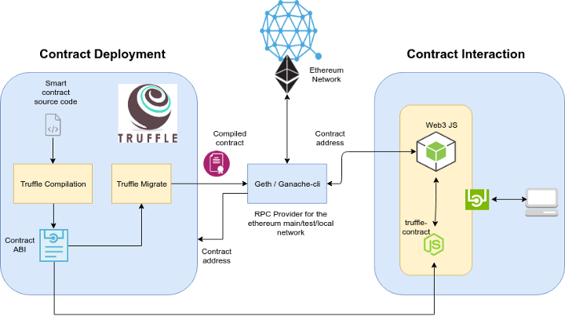

# Web3

## Web3: Refund by Location Smart Contract
> Initial system architecture design

## Project details

**Table of contents**
## Introduction

> A smart contract receives periodic updates from the employee’s phone on its GPS location. The refund by location smart contract is intended to be used in situations where one party, like an employer, agrees to pay another party, such as an employee, for their presence in a specific location for a specific amount of time. When all predetermined circumstances are met, a bitcoin payment is made in accordance with the pre-negotiated contract that is recorded in an Ethereum smart contract. 

## Objective

> The refund by location smart contract is aimed to be used when one party, for example an employer, agrees to pay another party, for example an employee, for being present in a certain geographic area for a certain duration. The employee’s phone sends its GPS location to a smart contract at a certain interval. Based on the pre-agreed contract codified in an Ethereum smart contract, a cryptocurrency payment is executed when all the agreed conditions are met.  
If, at any point, the GPS sensor indicates that an employee is outside the range of the agreed GPS area, the contract state will be updated to indicate that it is out of compliance. By the end of this project, you should produce an Ethereum based dApp that has both the smart contract tested and deployed in a testnet and a front end that will allow monitoring of the status.

## Truffle 

Truffle is a development environment, testing framework, and asset pipeline for Ethereum, aiming to make life as an Ethereum developer easier. With Truffle you get: Built-in smart contract compilation, linking, deployment and binary management.
Automated contract testing with Mocha and Chai.
## Install
$ npm install -g truffle
Note: To avoid any strange permissions errors, we recommend using nvm.

Quick Usage
For a default set of contracts and tests, run the following within an empty project directory:

$ truffle init
From there, you can run truffle compile, truffle migrate and truffle test to compile your contracts, deploy those contracts to the network, and run their associated unit tests.

Truffle comes bundled with a local development blockchain server that launches automatically when you invoke the commands above. If you'd like to configure a more advanced development environment we recommend you install the blockchain server separately by running npm install -g ganache at the command line.

## Ganache 
ganache: a command-line version of Truffle's blockchain server.
ganache-ui: A GUI for the server that displays your transaction history and chain state.
Documentation
Please see the Official Truffle Documentation for guides, tips, and examples.

-  Install
npm install -g yarn
yarn bootstrap

## Test
yarn test

## Adding dependencies to a package
cd packages/<truffle-package>
yarn add <npm-package> [--dev] # Use yarn
## Screenshots

> Mobile application

## Approaches
> Flutter mobile Application with Truffle Ethereum Blockchain
## Tests

> All the unit and integration tests are found here in the tests folder.

## Author

> 👤 **Birhanu Gebisa**
>
> - [Email](mailto:birhanugebisa@gmail.com), [GitHub](https://github.com/BirhanuGebisa), [LinkedIn](https://www.linkedin.com/in/birhanu-gebisa2721/)

> Show us your support

> Give us a ⭐ if you like this project, and also feel free to contact us at any moment.